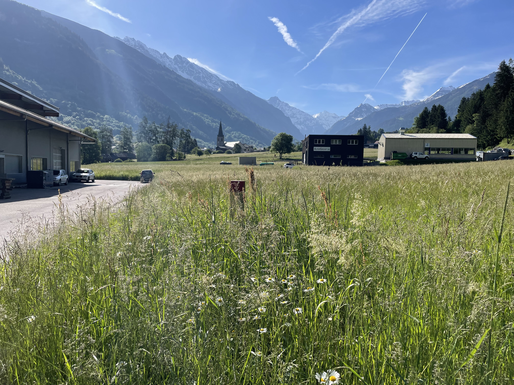
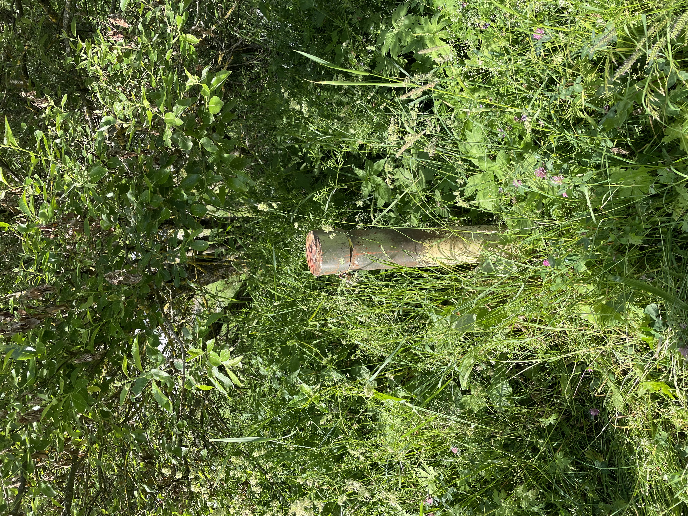
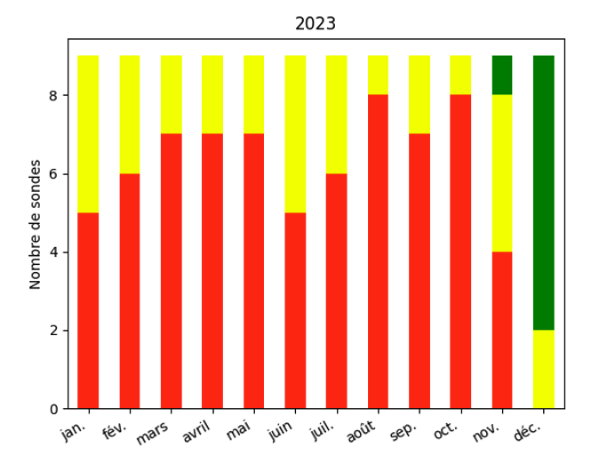

::: column-margin
#### Informations projet

**Durée** 06.2024 – 12.2024 (6 mois)

**Partenaires** BlueArk, Alpgéo, STREAM

**Financement** STREAM
:::

### Suivi de la nappe de la Dranse de Bagnes
::: {#fig-piezo layout-ncol=2}

Sondes pièzométriques le long de la nappe Profray et Versegères
:::

**Contexte et objectifs**

L'aquifère de la Dranse de Val de Bagnes est équipée de neuf sondes qui mesurent son niveau, sa température et sa conductivité. Les objectifs du projet sont de :

-   Détecter automatiquement les erreurs de mesure des sondes

-   Alerter lorsque le niveau de la nappe est trop bas

-   Estimer les valeurs manquantes de niveau de la nappe

-   Explorer les prédictions du niveau futur de la nappe

**Résultats**

***Détection automatiques d'erreurs de mesures et valeurs manquantes***

Un programme a été implémenté pour les détecter les erreurs de mesures (principalement des sauts de valeurs). Il peut être utile pour détecter les erreurs en temps réel pour des sondes qui communiquent des données chaque heure. SARIMAX a été utilisé pour estimer les valeurs manquantes en se basant sur la valeur des autres sondes tout en tenant compte de la saisonnalité.

***Alertes en cas de bas niveau***

Une analyse statistique permet de détecter les niveaux bas de nappe. Le niveau moyenné par mois est comparé avec ceux des années précédentes disponibles. Les mois les plus bas sont indiqués en rouge, ceux qui sont moyens en jaune et les plus élevés en vert. La Figure 2 montre la situation mensuelle pour l'année 2023 où la nappe était plus basse que d'habitude.

***Prédiction***

Les méthodes SARIMA permettent également de prédire le niveau futur de la nappe. Mais nous n'avons pas obtenu de bonnes prédictions. Pour de meilleures prédictions, il faudrait une analyse plus poussée sonde par sonde, tenant compte d'autres paramètres et variables, comme les prédictions météorologiques saisonnières

<figure>

<figcaption>

Figure 2 : Niveau des sondes pour l'année 2023. Cette année était sèche par comparaison aux années 2015-2022.

</figcaption>

</figure>

**Qui a participé ?**

-   BlueArk

-   Alpgéo

-   STREAM (F. Terrettaz, E. Neveu)

------------------------------------------------------------------------

[← Retour aux projets](../)