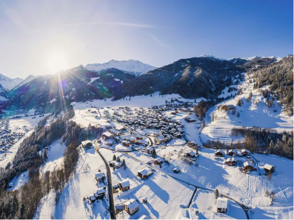
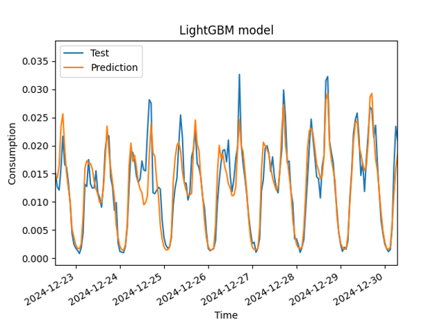

::: column-margin
#### Informations projet
**Durée** 08.2025--09.2025, 2 mois

**Partenaires** STREAM

**Financement** STREAM
:::

### Prédiction demande en eau potable pour la semaine - Bruson. 

::: {layout-ncol=2}

:::
Figure 1 : Bruson (crédit <https://www.verbier.ch/destination/bruson/>). A
droite, la zone d'habitation étudiée ( en vert) ainsi que les conduites
principales du réseau d'eau potable (bleu) (SIT Val de Bagnes).

**Contexte et objectifs**

Ce projet nous permet de prévoir la demande en eau potable pour une
semaine à une échelle horaire pour la zone de test Bruson- Le Sappey

**Résultats**

Les meilleures prévisions ont été obtenues avec LightGBM, cette méthode
s'est avérée rapide et facile. Après un apprentissage sur les données de
janvier 2022 à octobre 2024, les prédictions sont testées fin 2024, et
donnent une **erreur relative moyenne de 18.3%** **pour novembre et de
21.9% pour décembre par rapport à une consommation moyenne par heure
proche de 0.015 m^3^.**

Il est intéressant de remarquer que la demande est influencée par
plusieurs facteurs, dont l'heure, le jour de la semaine et le mois de
l'année alors que la température a peu d'importance. De plus, les
prédictions sont robustes même en fin d'année, alors que cette période
de fête de fin d'année différe du reste de l'année.

La méthode peut être testée rapidement à d'autres secteurs : notamment
il serait intéressant de la transférer à une zone possédant plus de
compteurs d\'eau et une influence touristique plus grande.

<figure>

<figcaption>
Figure 2 : Comparaison des prédictions [m3/h]
pour fin décembre par rapport à la demande mesurée pour le meilleur
modèle.
</figcaption>
</figure>

**Qui a participé ?**

-   STREAM (F. Terrettaz, E. Neveu)

**Valorisation**

-   Présentation : [AIDays, Martigny mars
    2026](https://ai-days.swiss-ai-center.ch/fr/schedule)

---

[← Retour aux projets](../)
